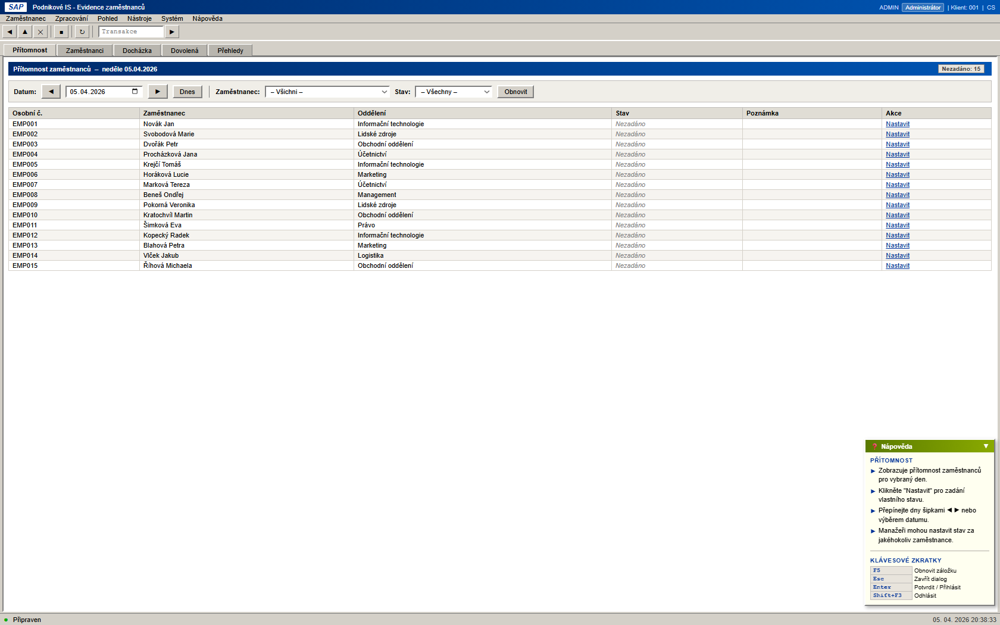
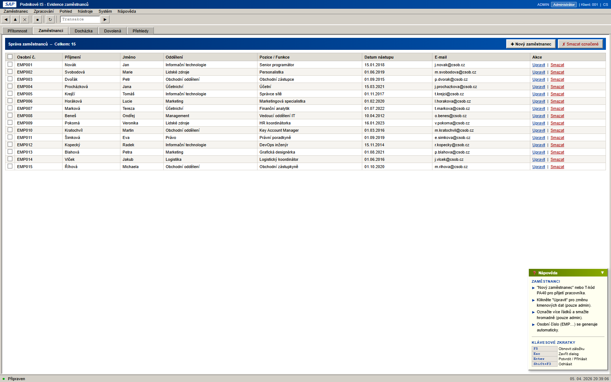
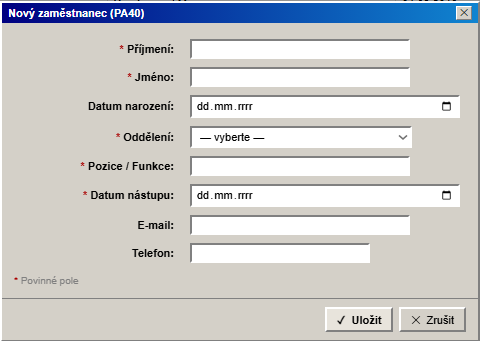
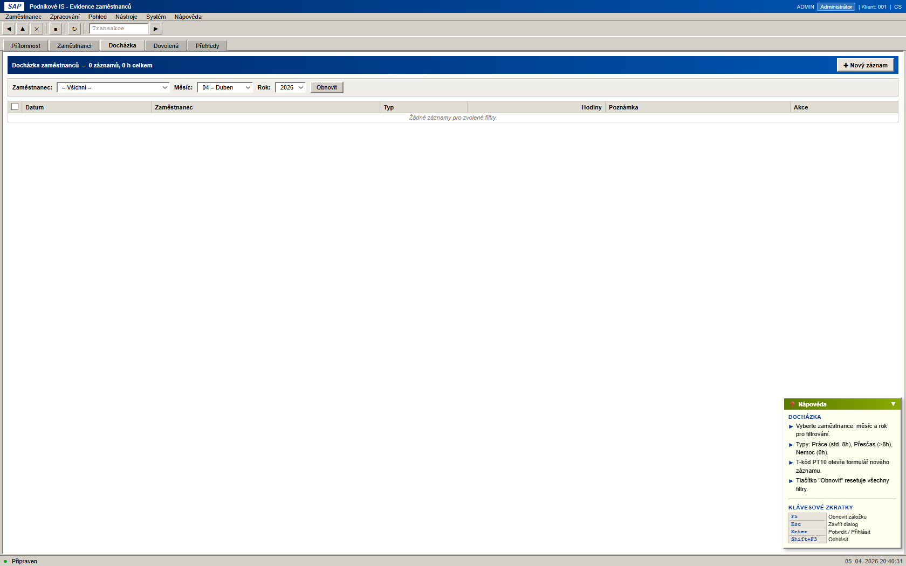
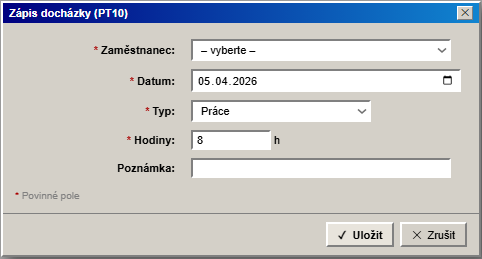
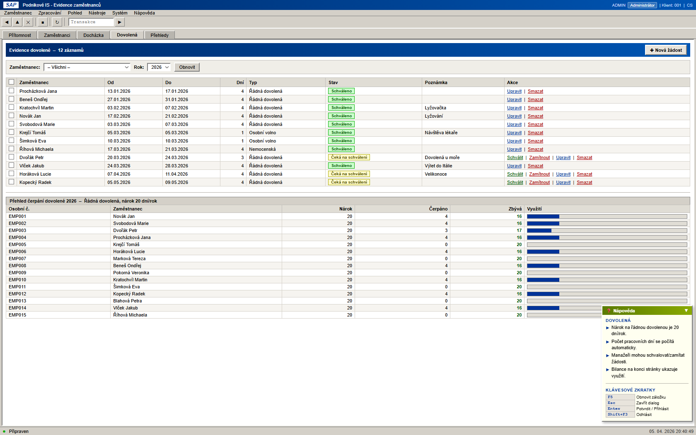
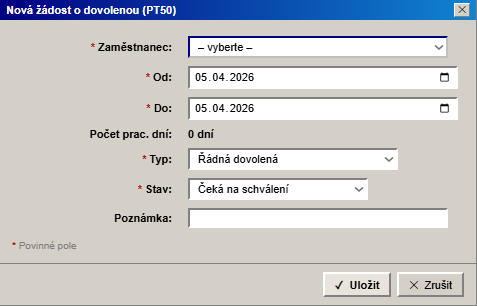
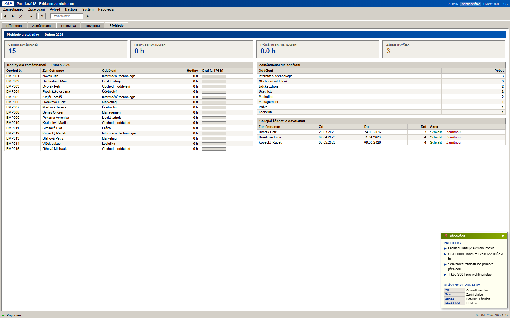
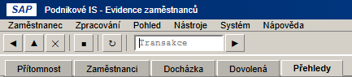

# Evidence zaměstnanců — HR modul

Webová aplikace simulující HR modul podnikového informačního systému SAP. Projekt vznikl jako součást školního předmětu Podnikové informační systémy na PEF. Vizuálně i funkčně napodobuje rozhraní SAP Logon 740 a pokrývá základní agendu správy zaměstnanců — přítomnost, docházku, dovolenou a přehledy.

Živá verze: [magginax.github.io/Employee_tracker-school_project](https://magginax.github.io/Employee_tracker-school_project/)

---

## Popis aplikace

Firma jako ČSOB potřebuje evidovat, kdo pracuje odkud, kolik hodin za měsíc odpracoval, jaké má dovolené a kdo je zrovna v kanceláři. V reálném prostředí tyto agendy zajišťuje SAP HCM nebo SuccessFactors. Tato aplikace ukazuje, jak by taková evidence mohla vypadat z pohledu uživatele — bez nutnosti mít skutečný SAP server.

Data se ukládají lokálně v prohlížeči (localStorage). Nic se neodesílá nikam ven.

---

## Přihlášení a role

Aplikace má tři úrovně přístupu. Co uživatel vidí a může dělat, závisí na jeho roli.

| Uživatel | Heslo | Role |
|---|---|---|
| ADMIN | admin123 | Administrátor |
| NOVAK | heslo123 | Manager |
| BENES | heslo123 | Manager |
| SVOBODOVA | heslo123 | Zaměstnanec |
| KREJCI | heslo123 | Zaměstnanec |
| KOPECKY | heslo123 | Zaměstnanec |
| HORAKOVA | heslo123 | Zaměstnanec |

Na přihlašovací obrazovce se zobrazuje plovoucí okno s demo přístupy — kliknutím na jméno se formulář vyplní automaticky.

**Cesta:** Úvodní obrazovka aplikace

<!-- screenshot: přihlašovací obrazovka se zobrazeným oknem demo přístupů -->

---

## Funkce

### Přítomnost

Záložka **Přítomnost** (nebo transakce `PP10` / `PP20`) zobrazuje, kde se každý zaměstnanec daný den nachází. Stav se vybírá z pěti možností: V kanceláři, Home office, Dovolená, Žádná směna, Jiný důvod.

Zobrazení lze filtrovat podle data, konkrétního zaměstnance nebo stavu. Datum se přepíná šipkami po dnech nebo výběrem z kalendáře. V záhlaví tabulky jsou barevné štítky se součty — kliknutím na štítek se seznam okamžitě filtruje.

Zaměstnanec může nastavovat pouze svůj vlastní stav. Manager a administrátor mohou upravovat záznamy kohokoliv.

**Cesta:** záložka Přítomnost / menu Pohled → Přítomnost / transakce PP10

<!-- screenshot: záložka Přítomnost s vyplněnými záznamy a barevnými štítky stavů -->

---

### Správa zaměstnanců

Záložka **Zaměstnanci** obsahuje seznam všech zaměstnanců s osobním číslem, jménem, oddělením, pozicí, datem nástupu a e-mailem.

Administrátor může přidávat nové zaměstnance (transakce `PA40`), upravovat jejich údaje (`PA30`) a mazat záznamy jednotlivě nebo hromadně pomocí zaškrtávacích políček. Manageři a zaměstnanci mají přístup jen pro čtení.

Při přidání zaměstnance systém automaticky generuje osobní číslo ve formátu `EMP###`.

**Cesta:** záložka Zaměstnanci / menu Zaměstnanec → Zobrazit (PA20) / Změnit (PA30) / Nástup (PA40)

<!-- screenshot: seznam zaměstnanců s tabulkou a tlačítkem Nový zaměstnanec -->

<!-- screenshot: formulář pro přidání nebo úpravu zaměstnance -->

---

### Docházka

Záložka **Docházka** (`PT10` / `PT40`) eviduje odpracované hodiny. Každý záznam má datum, zaměstnance, typ a počet hodin. Typy záznamu: Práce, Přesčas, Nemoc, Služební cesta, Školení.

Filtry umožňují zobrazit záznamy konkrétního zaměstnance za zvolený měsíc a rok. V záhlaví je průběžný součet hodin za zobrazené záznamy.

**Cesta:** záložka Docházka / menu Zpracování → Nový záznam docházky (PT10) / Přehled docházky (PT40)

<!-- screenshot: záložka Docházka s tabulkou záznamů a filtry -->

<!-- screenshot: formulář pro přidání záznamu docházky -->

---

### Dovolená

Záložka **Dovolená** (`PT50` / `PT60`) slouží k podávání a schvalování žádostí o volno. Typy: Řádná dovolená, Nemocenská, Osobní volno, Studijní volno, Náhradní volno.

Každá žádost prochází stavem: Čeká na schválení → Schváleno / Zamítnuto. Manager nebo administrátor může žádost schválit nebo zamítnout přímo z tabulky bez otevírání formuláře.

Pod tabulkou žádostí je přehled čerpání dovolené za aktuální rok. Pro každého zaměstnance zobrazuje nárok (20 dní), čerpáno a zbývající počet dní s vizuální lištou využití. Pokud zaměstnanec přečerpá nárok, zobrazí se záporné číslo červeně.

**Cesta:** záložka Dovolená / menu Zpracování → Nová žádost (PT50) / Přehled dovolené (PT60)

<!-- screenshot: záložka Dovolená s tabulkou žádostí a přehledem čerpání -->

<!-- screenshot: formulář pro novou žádost o dovolenou s výpočtem pracovních dní -->

---

### Přehledy

Záložka **Přehledy** (`S001`) poskytuje souhrnný pohled na celý tým za aktuální měsíc.

Zobrazuje čtyři klíčové ukazatele: celkový počet zaměstnanců, celkové odpracované hodiny, průměr hodin na osobu a počet žádostí čekajících na schválení. Pod tím jsou dvě tabulky — hodiny rozdělené podle zaměstnanců s grafickou lištou (vztaženo k 176 h měsíčnímu fondu) a počty zaměstnanců podle oddělení. Vpravo se zobrazují čekající žádosti o dovolenou, které může manager rovnou schválit nebo zamítnout.

**Cesta:** záložka Přehledy / menu Pohled → Přehledy / transakce S001

<!-- screenshot: záložka Přehledy se statistickými boxy a tabulkami -->

---

### Export dat

Menu **Nástroje → Export dat (JSON)** stáhne veškerá data (zaměstnanci, docházka, dovolené, přítomnost) jako JSON soubor. Slouží pro zálohu nebo přenos dat do jiného systému.

Ve stejném menu lze načíst vzorová data nebo vymazat všechna data a začít od nuly.

**Cesta:** menu Nástroje → Export dat (JSON)

---

### Změna hesla

Přihlášený uživatel si může změnit vlastní heslo. Systém ověří stávající heslo a uloží nové.

**Cesta:** menu Systém → Změnit heslo

---

### Navigace kódy transakcí

Pole v nástrojové liště (levý dolní roh, popis "Transakce") přijímá SAP kódy transakcí. Po zadání kódu a stisku Enter nebo tlačítka se aplikace přepne na příslušnou sekci.

Dostupné kódy: `PA20`, `PA30`, `PA40` (zaměstnanci), `PT10`, `PT40` (docházka), `PT50`, `PT60` (dovolená), `PP10`, `PP20` (přítomnost), `S001` (přehledy).

Aplikace obsahuje také dva easter eggy — `KAFE` a `DOKTOR`.

**Cesta:** pole Transakce v nástrojové liště

<!-- screenshot: nástrojová lišta s polem pro kód transakce -->

---

## Silné stránky

**Věrohodná imitace SAP.** Aplikace kopíruje vizuální jazyk SAP — title bar, menu bar, toolbar, ALV tabulky, stavový řádek s hodinami, transakční kódy. Komukoliv, kdo SAP zná, přijde rozhraní povědomé.

**Rolový přístup funguje důsledně.** Každá akce se kontroluje — zaměstnanec nevidí tlačítka, na která nemá právo, nikoli až po kliknutí obdrží chybovou hlášku.

**Workflow schvalování.** Dovolené mají třístavový životní cyklus a manager je může schvalovat nebo zamítat přímo z tabulky nebo z přehledů.

**Přehledy v reálném čase.** Statistiky se počítají za každého načtení ze skutečných dat — žádné cachované hodnoty.

**Vzorová data jedním kliknutím.** Tlačítko v menu Nástroje načte 15 zaměstnanců s docházkou, dovolenými a přítomností za aktuální měsíc. Data jsou dynamicky generována pro aktuální datum.

**Žádná závislost na serveru.** Aplikace je čistý HTML/CSS/JS. Spustí se v prohlížeči, funguje offline, hostuje se jako statická stránka.

---

## Limitace

**Data žijí jen v prohlížeči.** localStorage je vázaný na konkrétní prohlížeč a zařízení. Přihlásí-li se dva uživatelé každý na svém počítači, vidí každý jiná data. Žádná synchronizace neexistuje.

**Hesla nejsou hashována.** Přihlašovací údaje jsou uloženy jako prostý text v localStorage. Pro reálné nasazení by bylo nutné minimálně bcrypt na backendu.

**Pevný nárok dovolené.** Systém předpokládá 20 dní řádné dovolené ročně pro každého. Nastavení na úrovni zaměstnance neexistuje.

**Žádný audit log.** Nelze dohledat, kdo co kdy změnil. V reálném HR systému je auditovatelnost základní požadavek.

**Žádné notifikace.** Schválení dovolené se zaměstnanec dozví jedině tím, že si sám otevře záložku.

**Žádná validace překryvů.** Systém nehlídá, zda si zaměstnanec podává dvě dovolené ve stejném termínu.

---

## Možnosti napojení na ČSOB

Reálný HR modul v ČSOB běží na SAP HCM, respektive nových instalacích SuccessFactors. Webová aplikace by se mohla na tyto systémy napojit několika způsoby:

**SAP OData API.** SAP HCM a S/4HANA exponují HR data přes OData REST rozhraní. Aplikace by místo localStorage volala tyto endpointy pro čtení i zápis dat. Přihlašování by probíhalo přes SAP Identity Authentication Service.

**SuccessFactors API.** Pokud ČSOB migrovala na SuccessFactors, existuje REST API pokrývající správu zaměstnanců, Time & Attendance i Leave Management — přesně moduly, které aplikace simuluje.

**Active Directory / LDAP.** Přihlašování by se nahradilo napojením na podnikový Active Directory. Uživatel by se přihlásil svým doménovým účtem, role by se načítaly ze skupin v AD.

**Databázový backend.** Jednoduchý Node.js nebo Python backend s relační databází by nahradil localStorage a umožnil přístup z více zařízení, auditní záznamy a notifikace.

---

## Možnosti dalšího rozvoje

**Emailové notifikace.** Při podání nebo schválení žádosti o dovolenou zaslat zaměstnanci e-mail. V kombinaci s backendem triviální rozšíření.

**Mobilní zobrazení.** Aktuální layout je navržen pro desktop. Responzivní design by aplikaci zpřístupnil na telefonech.

**Export do Excelu.** Přehled docházky nebo dovolených jako XLSX soubor pro mzdovou účtárnu.

**Organizační schéma.** Vizualizace stromové struktury oddělení a nadřazených/podřízených vztahů.

**Flexibilní nároky dovolené.** Nastavení počtu dnů dovolené na úrovni zaměstnance nebo pracovní smlouvy.

**Notifikace v aplikaci.** Badge na záložce Přehledy, pokud existují čekající žádosti — manager by okamžitě viděl, že má co schvalovat.

**Přihlášení přes SSO.** Integrace s Microsoft Entra ID (dříve Azure AD) nebo Google Workspace pro single sign-on bez správy hesel v aplikaci.

**Rozšířené reporty.** Přehled přesčasů, absence, srovnání oddělení, trendové grafy po měsících.
